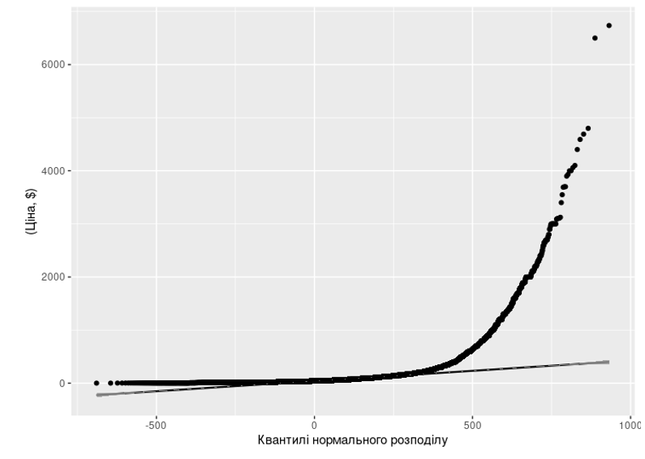
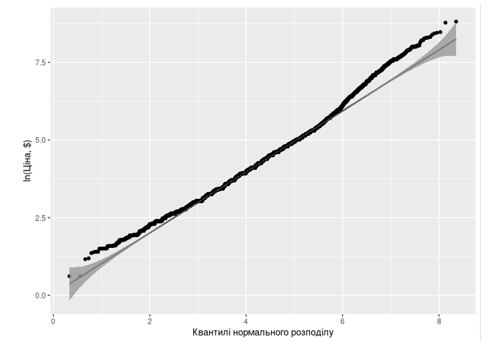

Дані взяті з Olist Store Dataset, що містить інформацію про електронну комерцію в Бразилії. Набір даних містить інформацію про 100 тисяч замовлень з 2016 по 2018 рік, зроблених на багатьох ринках у Бразилії. Дані містяться в окремих таблиць, які пов’язані між собою через ключові змінні. 
Завантаження та об’єднання таблиць

Дані були завантажені з наступних файлів:

olist_order_items_dataset.csv (замовлення та їх складові)

olist_order_reviews_dataset.csv (відгуки клієнтів)

olist_orders_dataset.csv (загальна інформація про замовлення)

olist_products_dataset.csv (деталі товарів)

olist_sellers_dataset.csv (інформація про продавців)

olist_customers_dataset.csv (інформація про клієнтів)

product_category_name_translation.csv (переклади категорій товарів)

Об’єднання даних здійснювалося через inner_join(), щоб уникнути неповних записів. Початковий набір даних містить 110750 колонок, 36 стовпчиків.

## Розподіли та викиди
 |  
