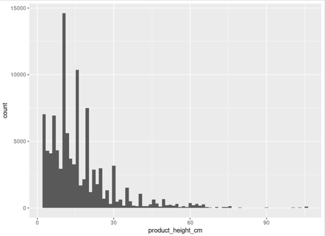

Дані взяті з [Olist Store Dataset](https://www.kaggle.com/datasets/olistbr/brazilian-ecommerce/data), що містить інформацію про електронну комерцію в Бразилії. Набір даних містить інформацію про 100 тисяч замовлень з 2016 по 2018 рік, зроблених на багатьох ринках у Бразилії. Дані містяться в окремих таблиць, які пов’язані між собою через ключові змінні. 

## Завантаження та об’єднання таблиць

Дані були завантажені з наступних файлів:

- olist_order_items_dataset.csv (замовлення та їх складові)

- olist_order_reviews_dataset.csv (відгуки клієнтів)

- olist_orders_dataset.csv (загальна інформація про замовлення)

- olist_products_dataset.csv (деталі товарів)

- olist_sellers_dataset.csv (інформація про продавців)

- olist_customers_dataset.csv (інформація про клієнтів)

- product_category_name_translation.csv (переклади категорій товарів)

Об’єднання даних здійснювалося через inner_join(), щоб уникнути неповних записів. Початковий набір даних містить 110750 колонок, 36 стовпчиків.

## Розподіли та викиди

### 1. Ціна товару

  
  

  

#### Дискриптивні статистики

  

  

### 2. Вага товару

  
  

  

#### Дискриптивні статистики

  

### 3. Довжина, ширина, висота товару

  
  
  

  

### 4. Вартість доставки

  

  

#### Дискриптивні статистики

  

### 5. Оцінка

  

### 6. Довжина назви, опису, кількість фото

  

# EDA

## Кількість замовлень зроблених покупцями з різних штатів

## 3. Медіана часу доставки

